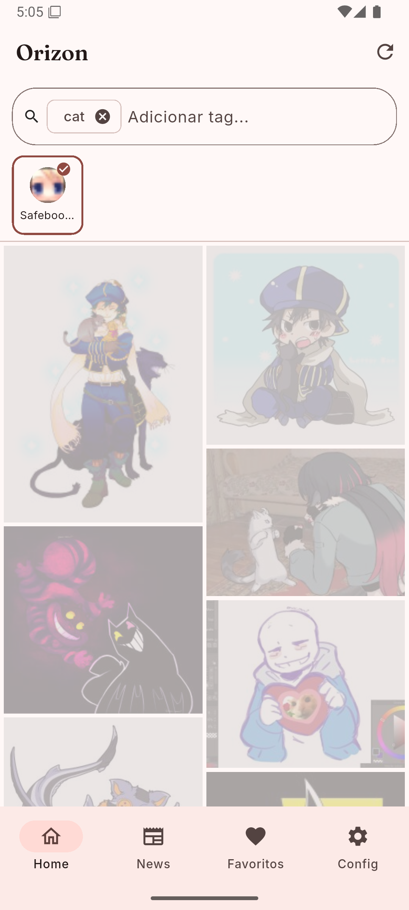
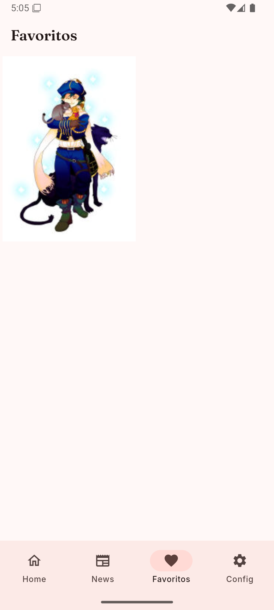
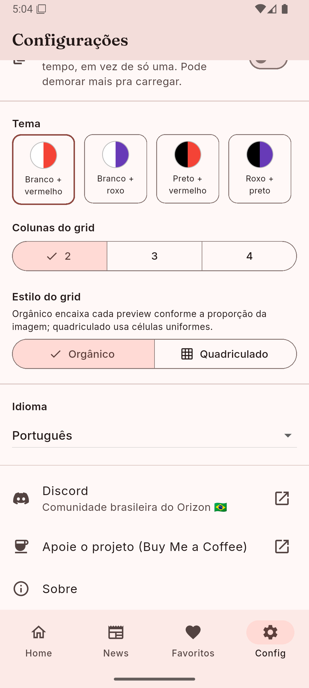
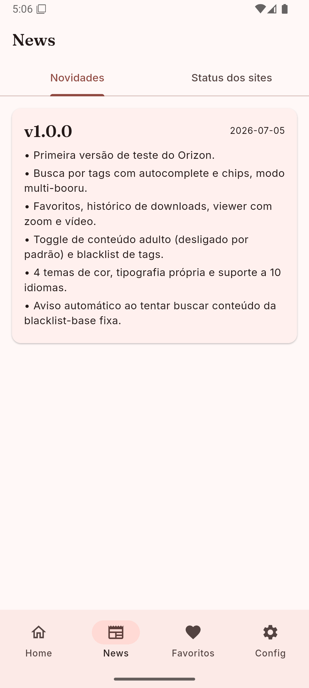
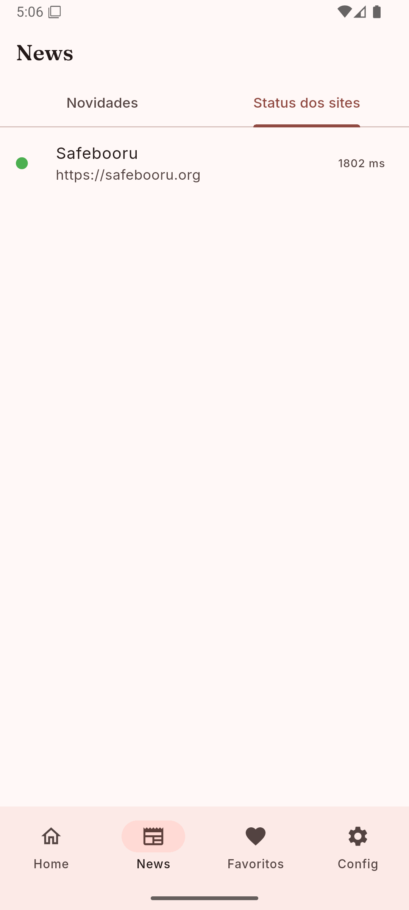

# Orizon

Orizon is a mobile client for booru-style image boards, built with Flutter.
You choose which sources to browse; the app ships with a single safe preset
(Safebooru) and a clean, comfortable reading experience.

## Safety first

Orizon is safe by default. Search results are filtered to safe-rated content
unless you explicitly change that in Settings, and what you see always
depends on your own configuration and the sources you choose to add.

One protection is permanent and cannot be disabled from the UI: Orizon never
displays content that sexualizes minors, under any configuration. Attempts
to search for it are blocked with a warning.

## Features

- Tag search with live autocomplete and chip-based input
- Multi-booru mode: search several sources at once
- Source manager with quick suggestions, plus support for any custom booru
  (Danbooru / Gelbooru 0.2 / Moebooru compatible APIs)
- Full-screen viewer with pinch-to-zoom and full video controls
  (play/pause, seek bar, mute)
- Favorites and download history, saving straight to your gallery
- Personal tag blacklist and an optional AI-generated image filter
- Backup and restore of your sources, favorites and settings
- Cache controls: clear on demand or automatically on close
- 4 color themes, custom typography, light and dark variants
- 10 languages: English, Portuguese, Spanish, French, German, Italian,
  Japanese, Korean, Chinese, Russian
- A News tab with the changelog and a live status check for your
  configured sources, run from your own device

## Screenshots

<p align="center">
  
  
  
</p>
<p align="center">
  
  
  
</p>

## Privacy

No accounts, no analytics, no ads, no server of ours. Everything is stored
locally on your device. See [PRIVACY.md](PRIVACY.md) for details.

## Tech stack

Flutter, Riverpod, Drift (SQLite), Dio, go_router.

## Getting started

```bash
flutter pub get
flutter gen-l10n
flutter run
```

## Community

- Discord (Brazilian community): https://discord.gg/FMsS8QnAtT
- Support the project: https://buymeacoffee.com/rizuwu

## License

GPL-3.0. See [LICENSE](LICENSE).
